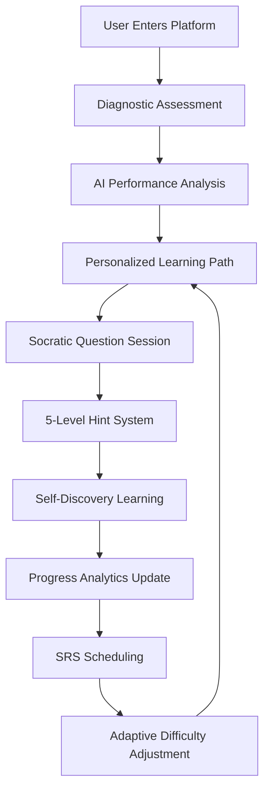

# 🎯 **AXONIX PLATFORM - COMPREHENSIVE OVERVIEW FOR QRAPTOR VIBE CODER**

*Adaptive AI-Powered Learning Platform with Socratic Method & Spaced Repetition*

---

## 🌟 **PLATFORM PHILOSOPHY & IDEOLOGY**

### **Core Educational Philosophy**
Axonix embodies a **revolutionary learning paradigm** that combines:

1. **🤔 Socratic Method Excellence**: Never giving direct answers, instead guiding learners through a structured 5-level hint ladder
2. **🧠 Adaptive Intelligence**: AI-driven personalization that adapts to individual learning patterns and performance
3. **🔄 Spaced Repetition Mastery**: Scientific approach to long-term knowledge retention using SRS algorithms
4. **🎮 Gamified Progression**: RPG-style leveling, XP, clans, and quests to maintain engagement
5. **📊 Data-Driven Insights**: Comprehensive analytics for both learners and AI optimization

### **Learning Flow Ideology**


---

## 🏗️ **TECHNICAL ARCHITECTURE**

### **Full-Stack Composition**
```
┌─────────────────────────────────────────────────────────────┐
│                    AXONIX ECOSYSTEM                         │
├─────────────────────────────────────────────────────────────┤
│  Frontend (Next.js + TypeScript + Tailwind + Shadcn-ui)   │
│  ├── Interactive Learning Sessions                         │
│  ├── Real-time AI Analysis UI                             │
│  ├── Progress Dashboards                                  │
│  └── Socratic Dialogue Interface                          │
├─────────────────────────────────────────────────────────────┤
│  Backend (Node.js + Express + MongoDB + Mongoose)         │
│  ├── AI Performance Analytics Engine                      │
│  ├── Test Generation Services                             │
│  ├── Authentication & User Management                     │
│  └── SRS Scheduling Algorithm                             │
├─────────────────────────────────────────────────────────────┤
│  AI Integration Layer (Qraptor AI)                        │
│  ├── Performance Analysis                                 │
│  ├── Personalized Test Generation                         │
│  ├── Real-time Learning Insights                          │
│  └── Adaptive Difficulty Adjustment                       │
├─────────────────────────────────────────────────────────────┤
│  Data Layer (MongoDB + Vector DB for Content)             │
│  ├── User Performance Analytics                           │
│  ├── Question Banks & Learning Content                    │
│  ├── Test Sessions & Progress Tracking                    │
│  └── SRS Scheduling Data                                  │
└─────────────────────────────────────────────────────────────┘
```

### **Core Technology Stack**

#### **🎨 Frontend Technologies**
- **Framework**: Next.js 14 (React 18) with App Router
- **Language**: TypeScript 5.0+ for type safety
- **Styling**: 
  - Tailwind CSS 3.3+ for utility-first styling
  - PostCSS for CSS processing
  - Custom Axonix theming system
- **UI Components**: 
  - Shadcn-ui component library
  - Radix UI primitives for accessibility
  - Lucide React icons
- **State Management**:
  - Zustand for global state management
  - React Query for server state
  - Custom hooks for component state
- **Authentication**: NextAuth.js with JWT tokens
- **Performance**:
  - Next.js Image optimization
  - Dynamic imports for code splitting
  - Scroll optimization hooks
  - Mobile-responsive design

#### **⚙️ Backend Technologies**
- **Runtime**: Node.js 18+ with Express.js framework
- **Language**: JavaScript (ES6+) with TypeScript migration
- **Authentication**: 
  - JSON Web Tokens (JWT)
  - Bcrypt for password hashing
  - Passport.js middleware
- **Database**: 
  - MongoDB 6.0+ as primary database
  - Mongoose ODM for data modeling
  - MongoDB Atlas for cloud deployment
- **API Architecture**:
  - RESTful API design
  - Express Router for modular routing
  - Middleware for authentication & validation
  - CORS configuration for cross-origin requests
- **Security**:
  - Helmet.js for security headers
  - Rate limiting with express-rate-limit
  - Input validation with Joi/Yup
  - HTTPS enforcement

#### **🤖 AI & Machine Learning Integration**
- **Primary AI Service**: Qraptor AI platform
- **AI Capabilities**:
  - Natural Language Processing for question analysis
  - Performance pattern recognition
  - Adaptive difficulty adjustment algorithms
  - Personalized learning path generation
- **Machine Learning Features**:
  - Spaced Repetition Algorithm (SM-2 based)
  - User behavior analysis
  - Predictive learning outcome modeling
  - Real-time performance analytics
- **AI Data Processing**:
  - JSON-based data exchange
  - Async processing for AI analysis
  - Fallback systems for AI downtime
  - Response caching for optimization

#### **📊 Data & Analytics Technologies**
- **Database Technologies**:
  - MongoDB for primary data storage
  - Redis for session management & caching
  - Vector database integration (planned)
- **Analytics Stack**:
  - Custom performance analytics engine
  - Real-time learning progress tracking
  - User behavior analytics
  - Learning effectiveness metrics
- **Data Processing**:
  - Background job processing
  - Data aggregation pipelines
  - Performance metrics calculation
  - Learning pattern analysis

#### **🔄 Real-time & Communication**
- **Real-time Features**:
  - WebSocket simulation for live feedback
  - Server-Sent Events for progress updates
  - Real-time AI analysis during sessions
- **Communication**:
  - HTTP/HTTPS for API communication
  - JSON for data exchange
  - REST API endpoints
  - GraphQL consideration for future

#### **🛠️ Development & DevOps Tools**
- **Package Management**: 
  - npm for dependency management
  - Workspaces for monorepo structure
- **Code Quality**:
  - ESLint for code linting
  - Prettier for code formatting
  - TypeScript for type checking
  - Husky for git hooks
- **Testing**:
  - Jest for unit testing
  - React Testing Library for component testing
  - Postman/Insomnia for API testing
- **Build Tools**:
  - Next.js built-in bundling
  - Webpack configuration
  - PostCSS processing
  - Environment variable management

#### **☁️ Deployment & Infrastructure**
- **Hosting Platforms**:
  - Vercel for frontend deployment
  - Railway/Heroku for backend hosting
  - MongoDB Atlas for database hosting
- **Domain & CDN**:
  - Custom domain configuration
  - CDN for static asset delivery
  - SSL certificate management
- **Environment Management**:
  - Multiple environment support (dev/staging/prod)
  - Environment variable management
  - Secret management for API keys
- **Monitoring**:
  - Application performance monitoring
  - Error tracking and logging
  - Uptime monitoring
  - Analytics dashboard

---

## 🎮 **USER EXPERIENCE FLOW**

### **1. User Onboarding Journey**
```typescript
interface OnboardingFlow {
  step1: "Account Creation & Email Verification";
  step2: "Domain Selection (C++, Python, JavaScript, etc.)";
  step3: "Experience Level Assessment (Beginner/Intermediate/Advanced)";
  step4: "Learning Preferences & Schedule Setup";
  step5: "Initial Diagnostic Test Administration";
  step6: "AI-Generated Personalized Learning Path";
}
```

### **2. Learning Session Types**
1. **🔍 Diagnostic Assessment** (15-20 min)
   - Evaluates current knowledge level
   - Identifies strengths and weaknesses
   - Creates baseline for personalization

2. **🧠 Learning Session** (30-45 min)
   - Interactive concept exploration
   - Socratic dialogue with AI guidance
   - Hands-on coding practice

3. **🎯 Practice Session** (20-30 min)
   - Reinforcement of learned concepts
   - Problem-solving with hint ladder
   - Skill consolidation

4. **📚 Review Session** (15-25 min)
   - SRS-scheduled knowledge reinforcement
   - Weakness area targeting
   - Long-term retention optimization

### **3. Socratic Method Implementation**
```typescript
interface HintLadder {
  level1: "Gentle nudge in right direction";
  level2: "Conceptual framework reminder";
  level3: "Specific technique suggestion";
  level4: "Detailed approach breakdown";
  level5: "Step-by-step guidance (last resort)";
}
```

---

## 🤖 **AI INTEGRATION & WORKFLOW**

### **Qraptor AI Integration Points**
1. **Performance Analysis**
   ```typescript
   interface AIAnalysisRequest {
     userPerformance: UserPerformanceData;
     sessionHistory: TestSession[];
     learningGoals: string[];
     weaknessAreas: string[];
   }
   ```

2. **Test Generation**
   ```typescript
   interface AITestGeneration {
     domain: string;
     difficulty: 'beginner' | 'intermediate' | 'advanced';
     weaknessTargeting: string[];
     learningObjectives: string[];
     questionCount: number;
     timeLimit: number;
   }
   ```

3. **Real-time Insights**
   ```typescript
   interface RealTimeAnalysis {
     currentResponse: any;
     confidenceScore: number;
     learningProgress: number;
     adaptiveRecommendations: string[];
   }
   ```

### **AI Workflow Process**
1. **🔄 Continuous Analysis**: Every user interaction feeds AI understanding
2. **📊 Performance Aggregation**: Multi-session data compilation for insights
3. **🎯 Targeted Generation**: AI creates personalized questions based on weaknesses
4. **⚡ Real-time Adaptation**: Dynamic difficulty and content adjustment
5. **📈 Progress Optimization**: AI optimizes learning path for maximum retention

---

## 📊 **DATA MODELS & SCHEMA**

### **Core User Model**
```javascript
const userSchema = {
  name: String,
  email: String,
  passwordHash: String,
  xp: Number,           // Experience points (gamification)
  level: Number,        // User level (gamification)
  clan: String,         // Social feature (optional)
  onboardingData: {
    domains: [String],
    experience_level: String,
    preferred_study_time: String,
    timezone: String
  },
  diagnosticTests: Map,  // Domain-specific diagnostic results
  learningProgress: {
    domains: Map,        // Progress per domain
    strengths: [String],
    weaknesses: [String],
    lastReviewDate: Date
  }
}
```

### **Performance Analytics Model**
```javascript
const performanceAnalyticsSchema = {
  userId: ObjectId,
  domain: String,
  questionResponses: [{
    questionId: String,
    response: Mixed,
    isCorrect: Boolean,
    timeSpent: Number,
    confidence: Number,
    hintsUsed: Number,
    timestamp: Date
  }],
  performanceMetrics: {
    accuracyRate: Number,
    averageTimePerQuestion: Number,
    conceptualUnderstanding: Number,
    problemSolvingEfficiency: Number,
    consistencyScore: Number
  },
  aiAnalysis: {
    strengthAreas: [String],
    weaknessAreas: [String],
    recommendedTopics: [String],
    difficultyAdjustment: String,
    personalizedInsights: String
  }
}
```

### **Test Session Model**
```javascript
const testSessionSchema = {
  userId: ObjectId,
  sessionType: String,  // 'diagnostic', 'learning', 'practice', 'review'
  domain: String,
  questions: [ObjectId],
  answers: Map,
  startTime: Date,
  endTime: Date,
  score: Number,
  timeSpent: Number,
  aiGenerated: Boolean,
  metadata: {
    difficultyLevel: String,
    topics: [String],
    learningObjectives: [String]
  }
}
```

---

---

## 🚀 **ADVANCED TECHNICAL FEATURES**

### **🧠 AI-Powered Learning Engine**

#### **Adaptive Learning Algorithm**
```typescript
interface AdaptiveLearningEngine {
  performanceAnalysis: {
    realTimeTracking: boolean;
    patternRecognition: string[];
    difficultyAdjustment: 'automatic' | 'manual' | 'hybrid';
    learningStyleDetection: boolean;
  };
  
  contentPersonalization: {
    dynamicQuestionGeneration: boolean;
    weaknessTargeting: boolean;
    strengthReinforcement: boolean;
    contextualHints: boolean;
  };
  
  predictiveModeling: {
    outcomeForecasting: boolean;
    retentionPrediction: boolean;
    strugglingStudentIdentification: boolean;
    optimalTimingRecommendations: boolean;
  };
}
```

#### **Spaced Repetition System (SRS) Implementation**
- **Algorithm**: Enhanced SM-2 algorithm with custom modifications
- **Features**:
  - Dynamic interval calculation based on performance
  - Difficulty factor adjustment per concept
  - Review scheduling optimization
  - Forgetting curve analysis
- **Technical Implementation**:
  ```typescript
  interface SRSEngine {
    calculateNextReview: (performance: number, previousInterval: number) => Date;
    adjustDifficulty: (concept: string, accuracy: number) => number;
    optimizeSchedule: (userTimezone: string, preferences: StudyPreferences) => Schedule;
    trackRetention: (conceptId: string, reviewHistory: Review[]) => RetentionRate;
  }
  ```

#### **Real-time Performance Analytics**
- **Live Tracking**: Continuous performance monitoring during sessions
- **Behavioral Analysis**: Mouse movement, typing patterns, pause analysis
- **Confidence Scoring**: Real-time confidence level assessment
- **Adaptive Feedback**: Dynamic hints and guidance based on struggle detection

### **🎯 Socratic Method Technology**

#### **5-Level Hint System**
```typescript
interface SocraticHintSystem {
  level1: {
    type: 'subtle_nudge';
    approach: 'gentle_direction';
    examples: ['Think about the relationship between...', 'Consider what happens when...'];
  };
  level2: {
    type: 'conceptual_framework';
    approach: 'broader_context';
    examples: ['This relates to the concept of...', 'Remember the principle that...'];
  };
  level3: {
    type: 'technique_suggestion';
    approach: 'method_guidance';
    examples: ['You might try using...', 'One approach could be...'];
  };
  level4: {
    type: 'detailed_breakdown';
    approach: 'step_identification';
    examples: ['Break this down into these steps...', 'First consider..., then...'];
  };
  level5: {
    type: 'guided_solution';
    approach: 'collaborative_solving';
    examples: ['Let\'s work through this together...', 'If we start with...'];
  };
}
```

#### **Intelligent Questioning Engine**
- **Question Generation**: AI-powered question creation based on learning objectives
- **Context Awareness**: Questions adapt to current user understanding
- **Prerequisite Checking**: Ensures foundational knowledge before advanced concepts
- **Misconception Detection**: Identifies and addresses common mistakes

### **📊 Advanced Analytics & Intelligence**

#### **Multi-dimensional Performance Tracking**
```typescript
interface PerformanceMetrics {
  cognitive: {
    comprehensionSpeed: number;
    retentionRate: number;
    transferLearning: number;
    problemSolvingEfficiency: number;
  };
  
  behavioral: {
    engagementLevel: number;
    persistenceScore: number;
    helpSeekingBehavior: string;
    learningConsistency: number;
  };
  
  metacognitive: {
    selfAssessmentAccuracy: number;
    strategicThinking: number;
    reflectiveAbility: number;
    learningAwareness: number;
  };
}
```

#### **Predictive Learning Analytics**
- **Success Prediction**: Forecast learning outcomes based on current patterns
- **Risk Identification**: Early warning system for struggling learners
- **Optimal Path Recommendation**: AI-suggested learning sequences
- **Time Estimation**: Accurate time-to-mastery predictions

#### **Learning Pattern Recognition**
- **Study Habit Analysis**: Optimal study time identification
- **Cognitive Load Assessment**: Mental effort measurement
- **Attention Pattern Tracking**: Focus and distraction analysis
- **Mastery Curve Modeling**: Individual learning progression patterns

### **🔧 Advanced Backend Architecture**

#### **Microservices Design Pattern**
```typescript
interface MicroservicesArchitecture {
  authService: {
    responsibilities: ['user_authentication', 'authorization', 'session_management'];
    technology: 'Node.js + JWT + bcrypt';
    database: 'MongoDB Users Collection';
  };
  
  learningEngine: {
    responsibilities: ['content_delivery', 'progress_tracking', 'session_management'];
    technology: 'Express.js + Mongoose';
    database: 'MongoDB Learning Collections';
  };
  
  analyticsService: {
    responsibilities: ['performance_analysis', 'reporting', 'insights_generation'];
    technology: 'Node.js + Data Processing';
    database: 'MongoDB Analytics Collections';
  };
  
  aiOrchestrator: {
    responsibilities: ['ai_integration', 'response_processing', 'fallback_handling'];
    technology: 'Express.js + Qraptor API';
    externalServices: ['Qraptor AI Platform'];
  };
}
```

#### **Database Optimization Features**
- **Indexing Strategy**: Optimized MongoDB indexes for query performance
- **Data Aggregation**: Complex aggregation pipelines for analytics
- **Caching Layer**: Redis integration for frequently accessed data
- **Connection Pooling**: Efficient database connection management

#### **API Design Excellence**
- **RESTful Architecture**: Clean, predictable API endpoints
- **Rate Limiting**: Intelligent request throttling
- **Error Handling**: Comprehensive error response system
- **API Versioning**: Future-proof API evolution support
- **Documentation**: Auto-generated API documentation

### **🎮 Gamification Technology Stack**

#### **RPG-Style Progression System**
```typescript
interface GamificationEngine {
  experienceSystem: {
    xpCalculation: (activity: LearningActivity) => number;
    levelProgression: (currentXP: number) => LevelInfo;
    xpMultipliers: Record<ActivityType, number>;
    bonusXPEvents: SpecialEvent[];
  };
  
  questSystem: {
    questGeneration: (userProfile: UserProfile) => Quest[];
    progressTracking: (questId: string, userAction: UserAction) => QuestProgress;
    rewardDistribution: (completedQuest: Quest) => Reward[];
    questDifficulty: 'easy' | 'medium' | 'hard' | 'epic';
  };
  
  clanSystem: {
    clanCreation: boolean;
    collaborativeLearning: boolean;
    leaderboards: boolean;
    groupChallenges: boolean;
  };
}
```

#### **Achievement & Badge System**
- **Dynamic Badges**: AI-generated achievements based on learning patterns
- **Milestone Recognition**: Major learning accomplishment tracking
- **Streak Tracking**: Consistency and persistence rewards
- **Social Features**: Shareable achievements and progress

### **📱 Responsive & Accessibility Features**

#### **Multi-Device Optimization**
- **Responsive Design**: Seamless experience across devices
- **Progressive Web App (PWA)**: App-like experience on mobile
- **Touch Optimization**: Mobile-first interaction design
- **Offline Capability**: Limited offline learning support

#### **Accessibility Implementation**
```typescript
interface AccessibilityFeatures {
  visualAccessibility: {
    screenReaderSupport: boolean;
    highContrastMode: boolean;
    fontSizeAdjustment: boolean;
    colorBlindFriendly: boolean;
  };
  
  auditoryAccessibility: {
    textToSpeech: boolean;
    audioDescriptions: boolean;
    visualCaptions: boolean;
  };
  
  motorAccessibility: {
    keyboardNavigation: boolean;
    mouseAlternatives: boolean;
    customizableControls: boolean;
  };
  
  cognitiveAccessibility: {
    simplifiedInterface: boolean;
    progressIndicators: boolean;
    clearInstructions: boolean;
    distractionReduction: boolean;
  };
}
```

### **🔐 Security & Privacy Technology**

#### **Advanced Security Measures**
- **Multi-Factor Authentication (MFA)**: Optional 2FA for enhanced security
- **OAuth Integration**: Google, GitHub authentication options
- **Session Security**: Secure session handling with automatic expiration
- **Data Encryption**: End-to-end encryption for sensitive data
- **GDPR Compliance**: Privacy by design implementation

#### **Privacy Protection Framework**
```typescript
interface PrivacyFramework {
  dataMinimization: {
    collectOnlyNecessary: boolean;
    purposeLimitation: boolean;
    retentionLimits: boolean;
  };
  
  userControl: {
    dataExport: boolean;
    accountDeletion: boolean;
    consentManagement: boolean;
    privacySettings: boolean;
  };
  
  anonymization: {
    aiTrainingData: boolean;
    analyticsData: boolean;
    researchData: boolean;
  };
}
```

### **⚡ Performance Optimization Technologies**

#### **Frontend Performance**
- **Code Splitting**: Automatic route and component-based splitting
- **Image Optimization**: Next.js Image component with WebP support
- **Lazy Loading**: On-demand component and content loading
- **Bundle Analysis**: Regular bundle size monitoring and optimization
- **CDN Integration**: Global content delivery for faster load times

#### **Backend Performance**
- **Database Optimization**: Query optimization and indexing strategies
- **Caching Strategies**: Multi-level caching (memory, Redis, CDN)
- **Background Processing**: Queue-based processing for heavy operations
- **Load Balancing**: Horizontal scaling preparation
- **Monitoring**: Real-time performance monitoring and alerting

### **🔄 Integration & API Technologies**

#### **Third-Party Integrations**
```typescript
interface ThirdPartyIntegrations {
  aiServices: {
    primary: 'Qraptor AI Platform';
    fallback: 'Custom AI Fallback System';
    capabilities: ['analysis', 'generation', 'personalization'];
  };
  
  authProviders: {
    email: 'Custom JWT System';
    social: ['Google OAuth', 'GitHub OAuth'];
    enterprise: 'SAML SSO (planned)';
  };
  
  analytics: {
    learning: 'Custom Analytics Engine';
    usage: 'Internal Tracking System';
    performance: 'Custom Performance Metrics';
  };
  
  communication: {
    email: 'Email Service Integration (planned)';
    notifications: 'Push Notification System (planned)';
    realTime: 'WebSocket Implementation';
  };
}
```

#### **API Gateway Features**
- **Request Routing**: Intelligent request distribution
- **Response Caching**: Strategic API response caching
- **Rate Limiting**: Per-user and per-endpoint limits
- **Authentication**: Centralized auth validation
- **Monitoring**: API usage analytics and performance tracking

## 🛠️ **TECHNICAL IMPLEMENTATION DETAILS**

### **Development Environment & Tools**

#### **Package Management & Workspaces**
```json
{
  "workspaces": [
    "frontend",
    "backend",
    "shared"
  ],
  "devDependencies": {
    "concurrently": "^8.2.0",
    "cross-env": "^7.0.3",
    "eslint": "^8.45.0",
    "prettier": "^3.0.0",
    "husky": "^8.0.3",
    "lint-staged": "^13.2.3"
  }
}
```

#### **Frontend Dependencies**
```json
{
  "dependencies": {
    "next": "14.0.0",
    "react": "18.2.0",
    "typescript": "5.2.2",
    "tailwindcss": "3.3.3",
    "@radix-ui/react-dialog": "^1.0.4",
    "@radix-ui/react-select": "^1.2.2",
    "lucide-react": "^0.263.1",
    "zustand": "^4.4.1",
    "@tanstack/react-query": "^4.32.6",
    "axios": "^1.4.0",
    "framer-motion": "^10.16.1"
  }
}
```

#### **Backend Dependencies**
```json
{
  "dependencies": {
    "express": "^4.18.2",
    "mongoose": "^7.4.3",
    "jsonwebtoken": "^9.0.1",
    "bcrypt": "^5.1.0",
    "cors": "^2.8.5",
    "helmet": "^7.0.0",
    "express-rate-limit": "^6.8.1",
    "joi": "^17.9.2",
    "dotenv": "^16.3.1",
    "nodemon": "^3.0.1"
  }
}
```

### **Code Quality & Standards**

#### **ESLint Configuration**
```json
{
  "extends": [
    "next/core-web-vitals",
    "@typescript-eslint/recommended",
    "prettier"
  ],
  "rules": {
    "@typescript-eslint/no-unused-vars": "error",
    "@typescript-eslint/explicit-function-return-type": "warn",
    "prefer-const": "error",
    "no-var": "error"
  }
}
```

#### **TypeScript Configuration**
```json
{
  "compilerOptions": {
    "target": "ES2020",
    "lib": ["DOM", "DOM.Iterable", "ES6"],
    "allowJs": true,
    "skipLibCheck": true,
    "strict": true,
    "forceConsistentCasingInFileNames": true,
    "noEmit": true,
    "esModuleInterop": true,
    "module": "esnext",
    "moduleResolution": "node",
    "resolveJsonModule": true,
    "isolatedModules": true,
    "jsx": "preserve",
    "incremental": true,
    "baseUrl": ".",
    "paths": {
      "@/*": ["./src/*"],
      "@/components/*": ["./src/components/*"],
      "@/lib/*": ["./src/lib/*"]
    }
  }
}
```

### **Testing Implementation**

#### **Jest Configuration**
```javascript
module.exports = {
  testEnvironment: 'jsdom',
  setupFilesAfterEnv: ['<rootDir>/jest.setup.js'],
  testPathIgnorePatterns: ['<rootDir>/.next/', '<rootDir>/node_modules/'],
  transform: {
    '^.+\\.(js|jsx|ts|tsx)$': ['babel-jest', { presets: ['next/babel'] }]
  },
  moduleNameMapping: {
    '^@/(.*)$': '<rootDir>/src/$1'
  }
};
```

#### **Testing Strategy**
- **Unit Tests**: Component and utility function testing
- **Integration Tests**: API endpoint testing
- **E2E Tests**: User journey testing (planned)
- **Performance Tests**: Load and stress testing
- **Accessibility Tests**: WCAG compliance testing

### **Deployment Configuration**

#### **Vercel Deployment (Frontend)**
```json
{
  "version": 2,
  "builds": [
    {
      "src": "package.json",
      "use": "@vercel/next"
    }
  ],
  "env": {
    "NEXT_PUBLIC_API_URL": "@api-url",
    "NEXT_PUBLIC_QRAPTOR_API_KEY": "@qraptor-key"
  }
}
```

#### **Railway Deployment (Backend)**
```dockerfile
FROM node:18-alpine

WORKDIR /app

COPY package*.json ./
RUN npm ci --only=production

COPY . .

EXPOSE 5000

CMD ["npm", "start"]
```

### **Database Schema Examples**

#### **User Collection Schema**
```javascript
{
  _id: ObjectId,
  name: String,
  email: String,
  passwordHash: String,
  xp: Number,
  level: Number,
  onboardingData: {
    domains: [String],
    experience_level: String,
    completed_at: Date
  },
  diagnosticTests: {
    "cpp": { completed: Boolean, score: Number },
    "python": { completed: Boolean, score: Number }
  },
  createdAt: Date,
  updatedAt: Date
}
```

#### **Test Session Collection Schema**
```javascript
{
  _id: ObjectId,
  userId: ObjectId,
  sessionType: String,
  domain: String,
  questions: [ObjectId],
  answers: {
    "questionId": {
      response: Mixed,
      isCorrect: Boolean,
      timeSpent: Number,
      hintsUsed: Number
    }
  },
  startTime: Date,
  endTime: Date,
  score: Number,
  aiGenerated: Boolean,
  createdAt: Date
}
```

#### **Performance Analytics Collection Schema**
```javascript
{
  _id: ObjectId,
  userId: ObjectId,
  domain: String,
  sessionId: ObjectId,
  questionResponses: [{
    questionId: ObjectId,
    response: Mixed,
    isCorrect: Boolean,
    timeSpent: Number,
    confidence: Number,
    timestamp: Date
  }],
  performanceMetrics: {
    accuracyRate: Number,
    averageTimePerQuestion: Number,
    conceptualUnderstanding: Number
  },
  aiAnalysis: {
    strengthAreas: [String],
    weaknessAreas: [String],
    recommendedTopics: [String]
  },
  createdAt: Date,
  updatedAt: Date
}
```

---

## 🚀 **KEY PLATFORM FEATURES**

### **1. Advanced Adaptive Learning Engine**
- **AI-Powered Personalization**: Deep learning algorithms analyze user patterns
- **Dynamic Difficulty Adjustment**: Real-time question difficulty based on performance
- **Learning Style Detection**: Automatic identification of optimal learning approaches
- **Weakness Targeting**: Laser-focused improvement on identified knowledge gaps
- **Progress Optimization**: Continuous optimization of learning paths for maximum efficiency
- **Predictive Analytics**: Forecast learning outcomes and identify at-risk students

### **2. Sophisticated Socratic Method Implementation**
- **Intelligent No-Direct-Answers Policy**: AI-enforced discovery-based learning
- **5-Level Progressive Hint System**: Structured guidance from subtle to detailed
- **Context-Aware Questioning**: Questions adapt to current understanding level
- **Misconception Detection**: Proactive identification and correction of common errors
- **Critical Thinking Development**: Systematic development of problem-solving skills
- **Collaborative Problem Solving**: AI guides users to solutions through dialogue

### **3. Advanced Spaced Repetition System (SRS)**
- **Enhanced SM-2 Algorithm**: Custom modifications for programming concept retention
- **Adaptive Scheduling**: Dynamic review intervals based on individual performance
- **Forgetting Curve Analysis**: Scientific approach to long-term knowledge retention
- **Difficulty Factor Adjustment**: Per-concept difficulty tracking and optimization
- **Optimal Timing Recommendations**: AI-suggested study times for maximum effectiveness
- **Cross-Domain Knowledge Transfer**: Leveraging learning across different programming languages

### **4. Comprehensive Gamification & Engagement**
- **RPG-Style Progression System**: XP, levels, and skill trees for motivation
- **Dynamic Quest Generation**: AI-created challenges based on learning goals
- **Clan & Social Learning**: Collaborative learning communities and peer support
- **Achievement & Badge System**: Recognition for learning milestones and consistency
- **Leaderboards & Competitions**: Friendly competition to drive engagement
- **Streak Tracking**: Consistency rewards and habit formation support

### **5. Real-time Performance Analytics & Intelligence**
- **Live Learning Monitoring**: Continuous tracking during learning sessions
- **Behavioral Pattern Analysis**: Mouse movement, typing patterns, pause detection
- **Confidence Scoring**: Real-time assessment of user understanding
- **Multi-dimensional Metrics**: Cognitive, behavioral, and metacognitive tracking
- **Predictive Risk Assessment**: Early identification of struggling learners
- **Personalized Insights**: AI-generated recommendations for improvement

### **6. Advanced Content Management & Generation**
- **AI-Powered Question Generation**: Dynamic creation of relevant practice problems
- **Contextual Content Delivery**: Adaptive content based on user progress
- **Multi-Modal Learning Support**: Text, visual, and interactive content types
- **Prerequisite Checking**: Automatic verification of foundational knowledge
- **Learning Objective Mapping**: Clear alignment between content and goals
- **Quality Assurance**: AI validation of generated content accuracy

### **7. Robust Technical Infrastructure**
- **Microservices Architecture**: Scalable, maintainable service design
- **High-Performance Database**: Optimized MongoDB with intelligent indexing
- **Real-time Communication**: WebSocket implementation for live features
- **Advanced Caching**: Multi-layer caching for optimal performance
- **Security Excellence**: JWT authentication, encryption, and privacy protection
- **API-First Design**: Clean, documented RESTful API architecture

### **8. Accessibility & Inclusivity Features**
- **WCAG 2.1 Compliance**: Full accessibility standard adherence
- **Multi-Device Optimization**: Seamless experience across all platforms
- **Screen Reader Support**: Complete navigation for visually impaired users
- **Keyboard Navigation**: Full functionality without mouse dependency
- **Customizable Interface**: User-controlled font sizes, contrast, and layouts
- **Language Support**: Multi-language platform capability (planned)

### **9. Advanced AI Integration Capabilities**
- **Qraptor AI Platform Integration**: Seamless AI service connectivity
- **Fallback AI Systems**: Robust handling of AI service interruptions
- **Performance Pattern Recognition**: Deep analysis of learning behaviors
- **Adaptive Content Recommendation**: AI-suggested learning materials
- **Real-time Insight Generation**: Live feedback during learning sessions
- **Learning Outcome Prediction**: Forecast of user success and challenges

### **10. Developer-Friendly Architecture**
- **TypeScript Implementation**: Type-safe development across the platform
- **Component-Based Design**: Reusable, maintainable UI components
- **API Documentation**: Comprehensive, auto-generated documentation
- **Testing Framework**: Unit, integration, and E2E testing capabilities
- **Development Tools**: ESLint, Prettier, Husky for code quality
- **Deployment Automation**: CI/CD pipeline for reliable releases

---

## 🔧 **IMPLEMENTATION DETAILS**

### **Frontend Components Structure**
```
src/
├── components/
│   ├── auth/              # Authentication UI
│   ├── dashboard/         # User dashboard & analytics
│   ├── learning/          # Learning session components
│   │   ├── LearningSession.tsx
│   │   ├── QraptorWorkflow.tsx
│   │   └── SocraticInterface.tsx
│   ├── onboarding/        # User onboarding flow
│   └── ui/                # Reusable UI components (Shadcn-ui)
├── pages/
│   ├── learn.tsx          # Main learning interface
│   ├── test.tsx           # Test taking interface
│   ├── dashboard.tsx      # Progress & analytics
│   └── api/               # API routes for AI integration
├── lib/
│   ├── auth.ts            # Authentication logic
│   ├── qraptor.ts         # AI service integration
│   └── api.ts             # Backend API client
└── hooks/
    ├── useSession.ts      # Session management
    └── useScrollOptimization.ts
```

### **Backend Services Structure**
```
backend/
├── models/
│   ├── User.js                    # User data model
│   ├── TestSession.js             # Test session tracking
│   ├── LearningProgress.js        # Progress tracking
│   ├── DomainQuestions.js         # Question bank
│   └── UserPerformanceAnalytics.js # AI analytics
├── routes/
│   ├── auth.js                    # Authentication endpoints
│   ├── test.js                    # Test management
│   ├── analytics.js               # Performance analytics
│   ├── progress.js                # Learning progress
│   └── ai-test.js                 # AI test generation
├── services/
│   ├── AIPerformanceAnalyzer.js   # AI analysis service
│   ├── AITestGenerationService.js # AI test creation
│   └── TestService.ts             # Test management service
└── middleware/
    └── auth.js                    # JWT authentication
```

---

## 🌊 **USER EXPERIENCE FLOW DETAILS**

### **1. Platform Entry → AI-Driven Learning**
```typescript
// User Journey Stages
const userJourney = {
  stage1: {
    name: "Platform Discovery",
    actions: ["Account creation", "Domain selection", "Initial assessment"],
    aiInvolvement: "Minimal - basic preference gathering"
  },
  stage2: {
    name: "Diagnostic Phase",
    actions: ["Comprehensive testing", "Performance analysis", "Baseline establishment"],
    aiInvolvement: "High - deep performance analysis and weakness identification"
  },
  stage3: {
    name: "Personalized Learning",
    actions: ["Custom learning path", "Adaptive content", "Real-time guidance"],
    aiInvolvement: "Maximum - continuous adaptation and optimization"
  },
  stage4: {
    name: "Mastery & Retention",
    actions: ["SRS reviews", "Advanced challenges", "Skill consolidation"],
    aiInvolvement: "Strategic - long-term retention optimization"
  }
}
```

### **2. Socratic Interaction Pattern**
```typescript
interface SocraticInteraction {
  userQuestion: string;
  aiResponse: {
    type: 'hint' | 'question' | 'guidance';
    level: 1 | 2 | 3 | 4 | 5;
    content: string;
    followUp: string[];
  };
  expectedUserAction: 'think' | 'respond' | 'explore' | 'practice';
}
```

### **3. Real-time Learning Analytics**
```typescript
interface RealTimeLearningState {
  currentProgress: number;
  confidenceLevel: number;
  strugglingAreas: string[];
  strengthAreas: string[];
  nextRecommendedAction: {
    type: 'review' | 'advance' | 'practice' | 'break';
    reason: string;
    estimatedDuration: number;
  };
}
```

---

## 🎯 **QRAPTOR INTEGRATION STRATEGY**

### **AI Service Integration Points**
1. **User Performance Analysis**
   ```typescript
   const analyzeUserPerformance = async (userData: UserPerformanceData) => {
     const qraptorResponse = await qraptorClient.post('/analyze-performance', {
       userHistory: userData.sessionHistory,
       currentLevel: userData.level,
       learningGoals: userData.goals,
       weaknessAreas: userData.weaknesses
     });
     
     return qraptorResponse.data.insights;
   };
   ```

2. **Dynamic Test Generation**
   ```typescript
   const generatePersonalizedTest = async (userProfile: UserProfile) => {
     const testRequest = {
       domain: userProfile.currentDomain,
       difficulty: userProfile.currentLevel,
       targetWeaknesses: userProfile.identifiedWeaknesses,
       learningObjectives: userProfile.currentObjectives,
       timeConstraint: userProfile.preferredSessionLength
     };
     
     return await qraptorClient.generateTest(testRequest);
   };
   ```

3. **Real-time Learning Guidance**
   ```typescript
   const provideLearningGuidance = async (currentContext: LearningContext) => {
     const guidanceRequest = {
       currentQuestion: currentContext.question,
       userResponse: currentContext.response,
       sessionProgress: currentContext.progress,
       hintsAlreadyGiven: currentContext.hintsUsed
     };
     
     return await qraptorClient.provideSocraticGuidance(guidanceRequest);
   };
   ```

---

## 📈 **PLATFORM SCALABILITY & PERFORMANCE**

### **Performance Optimization Strategies**
1. **Frontend Optimization**
   - Next.js SSR for faster initial loads
   - Component lazy loading for large learning sessions
   - Optimistic UI updates for better perceived performance
   - WebSocket simulation for real-time feedback

2. **Backend Optimization**
   - MongoDB indexing for fast query performance
   - Caching layer for frequently accessed content
   - API rate limiting for stable service
   - Background processing for AI analysis

3. **AI Integration Optimization**
   - Batch processing for performance analytics
   - Caching of AI responses for common patterns
   - Fallback systems for AI service downtime
   - Progressive enhancement for AI features

### **Scalability Considerations**
- **Microservices Architecture**: Modular design for independent scaling
- **Database Sharding**: User-based data distribution
- **CDN Integration**: Global content delivery
- **Load Balancing**: Multiple server instance support

---

## 🔒 **SECURITY & PRIVACY**

### **Security Implementation**
- **JWT Authentication**: Secure session management
- **Password Hashing**: Bcrypt for secure password storage
- **Input Validation**: Comprehensive data sanitization
- **Rate Limiting**: API abuse prevention
- **HTTPS Enforcement**: Encrypted data transmission

### **Privacy Protection**
- **GDPR Compliance**: User data protection rights
- **Data Minimization**: Only necessary data collection
- **Anonymization**: Performance data anonymization for AI training
- **User Consent**: Clear privacy policy and consent management

---

## 🎨 **UI/UX DESIGN PHILOSOPHY**

### **Design Principles**
1. **🎯 Focus-Driven Interface**: Minimal distractions during learning
2. **🎮 Gamified Elements**: Engaging but not overwhelming
3. **📱 Responsive Design**: Seamless across all devices
4. **♿ Accessibility**: Inclusive design for all learners
5. **🌙 Dark/Light Modes**: User preference support

### **Brand Identity (Axonix)**
- **Color Palette**: Professional blues and greens with accent colors
- **Typography**: Clean, readable fonts optimized for learning content
- **Iconography**: Consistent, intuitive icon system
- **Animation**: Subtle, purposeful animations for feedback

---

## 🚀 **DEPLOYMENT & DEVELOPMENT WORKFLOW**

### **Development Environment**
```bash
# Frontend Development
cd frontend && npm run dev

# Backend Development  
cd backend && npm run dev

# Full Stack Development
npm run dev (runs both frontend and backend concurrently)
```

### **Environment Configuration**
```typescript
interface EnvironmentConfig {
  frontend: {
    NEXT_PUBLIC_API_URL: string;
    NEXT_PUBLIC_QRAPTOR_API_KEY: string;
  };
  backend: {
    MONGODB_URI: string;
    JWT_SECRET: string;
    QRAPTOR_API_URL: string;
    QRAPTOR_API_KEY: string;
    PORT: number;
  };
}
```

### **Deployment Strategy**
- **Frontend**: Vercel deployment with Next.js optimization
- **Backend**: Railway/Heroku with MongoDB Atlas
- **Database**: MongoDB Atlas cloud deployment
- **AI Services**: Qraptor cloud integration

---

## 🎯 **SUCCESS METRICS & KPIs**

### **Learning Effectiveness Metrics**
- **Knowledge Retention Rate**: Long-term concept retention
- **Problem-Solving Improvement**: Pre/post assessment comparisons
- **Learning Velocity**: Speed of concept mastery
- **Engagement Duration**: Time spent in productive learning

### **Platform Performance Metrics**
- **User Retention Rate**: Monthly active user retention
- **Session Completion Rate**: Learning session completion percentage
- **AI Accuracy Rate**: Quality of AI-generated content and analysis
- **User Satisfaction Score**: Net Promoter Score (NPS) tracking

### **Technical Performance Metrics**
- **Response Time**: API response times under 200ms
- **Uptime**: 99.9% platform availability
- **Error Rate**: Less than 0.1% error rate
- **Scalability**: Support for concurrent users

---

## 🔮 **FUTURE ROADMAP & EXTENSIONS**

### **Planned Enhancements**
1. **🌐 Multi-language Support**: International expansion
2. **🤝 Collaborative Learning**: Peer-to-peer learning features
3. **📱 Mobile App**: Native mobile applications
4. **🎓 Certification System**: Skill verification and credentials
5. **🏢 Enterprise Features**: Corporate training modules

### **Advanced AI Features**
1. **🧠 Emotional Intelligence**: Mood-based learning adaptation
2. **🎯 Predictive Analytics**: Learning outcome prediction
3. **🔊 Voice Interaction**: Voice-based learning sessions
4. **👁️ Eye Tracking**: Attention-based content optimization
5. **🤖 Advanced Tutoring**: More sophisticated Socratic dialogues

---

## 📞 **CONTACT & INTEGRATION SUPPORT**

### **For Qraptor Integration Team**
- **Documentation**: Comprehensive API documentation in `/docs`
- **Test Endpoints**: Available test APIs for integration validation
- **Sample Data**: Mock data sets for development and testing
- **Integration Examples**: Working code examples for AI service integration

### **Support Resources**
- **Developer Guide**: Step-by-step integration instructions
- **API Reference**: Complete API endpoint documentation
- **Best Practices**: Recommended implementation patterns
- **Troubleshooting**: Common issues and solutions

---

**🎯 This platform represents the future of adaptive learning - where AI meets pedagogy to create personalized, effective, and engaging educational experiences. The Qraptor integration will elevate this platform to unprecedented levels of intelligent tutoring and learning optimization.**

---

*Last Updated: August 27, 2025*  
*Platform Version: 2.0*  
*Documentation Version: 1.0*
