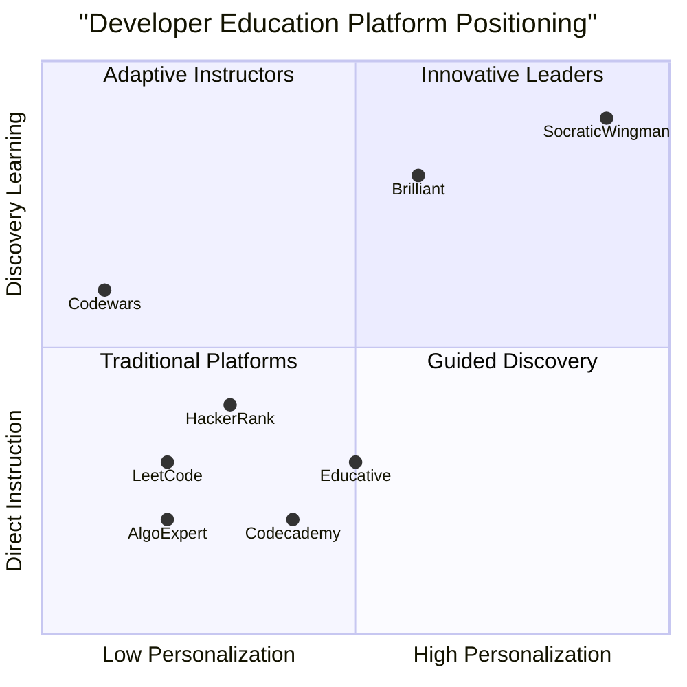
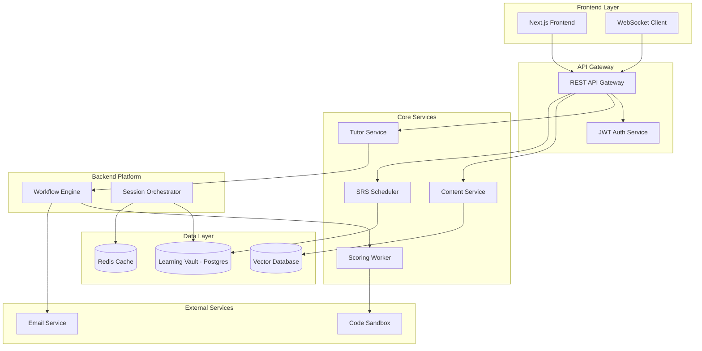
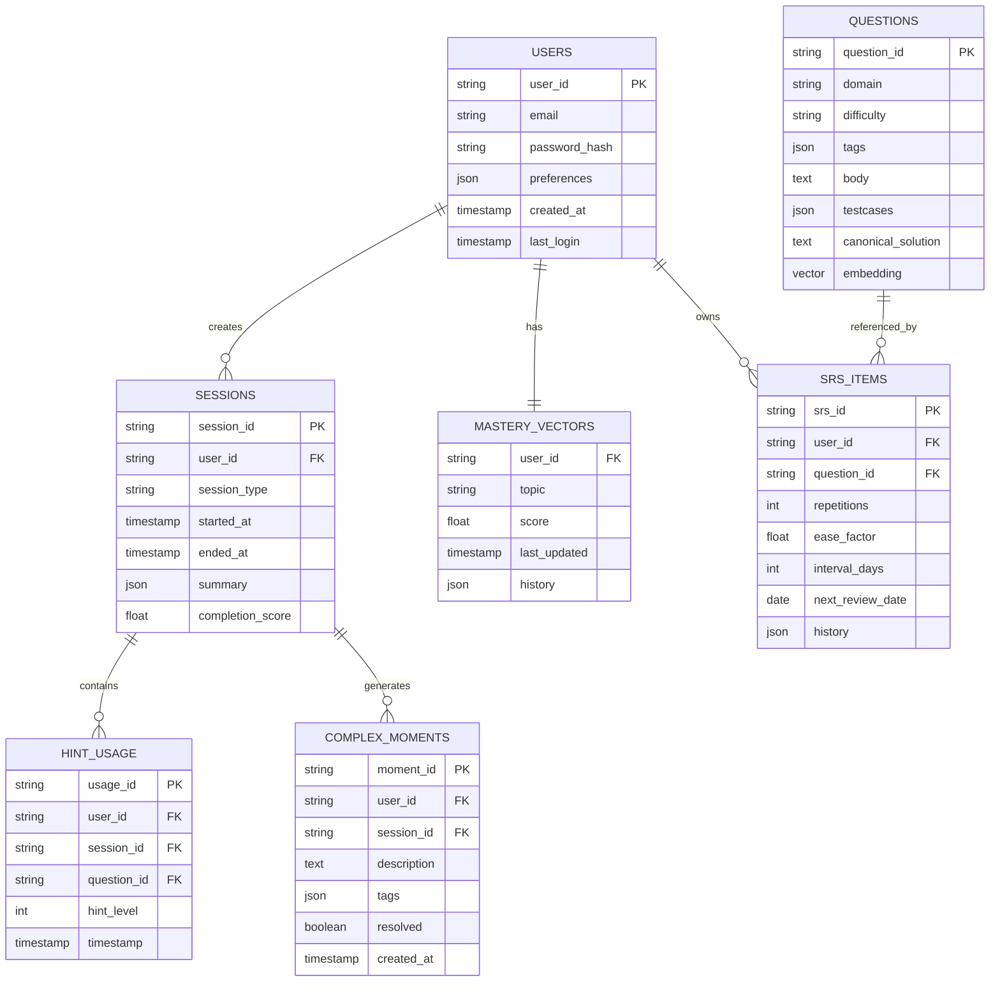

# SocraticWingman Product Requirements Document (PRD)

## 1. Language & Project Information

**Language:** English  
**Programming Language:** Next.js, TypeScript, Tailwind CSS, Shadcn-ui  
**Project Name:** socratic_wingman  
**Original Requirements:** An adaptive tutor for beginner→intermediate developers that teaches via Socratic questioning and a 5-level hint ladder, enforces "no direct answers", and uses SRS to remember learning. Full-stack product with Next.js frontend, backend APIs, microservices architecture, Learning Vault (DB + vector DB), code-sandbox integration, SRS scheduler, analytics, and admin dashboard.

## 2. Product Definition

### 2.1 Product Goals

1. **Adaptive Learning Excellence**: Create an intelligent tutoring system that adapts to individual learning patterns, providing personalized difficulty progression and optimal challenge levels for sustained engagement and skill development.

2. **Socratic Method Mastery**: Implement a rigorous "no direct answers" policy through a structured 5-level hint ladder that guides learners to discover solutions independently, fostering critical thinking and problem-solving skills essential for software development.

3. **Long-term Retention Optimization**: Leverage spaced repetition algorithms (SRS) to ensure knowledge retention over time, creating a sustainable learning experience that builds upon previous concepts and prevents skill decay.

### 2.2 User Stories

**As a beginner developer**, I want to receive personalized coding challenges that adapt to my skill level, so that I can progress without feeling overwhelmed or under-challenged.

**As an intermediate developer preparing for interviews**, I want access to a hint system that guides me toward solutions without giving direct answers, so that I can develop independent problem-solving skills.

**As a busy professional**, I want a spaced repetition system that reminds me to review concepts at optimal intervals, so that I can retain knowledge long-term despite irregular study schedules.

**As a learner struggling with a concept**, I want to record complex moments and receive targeted remediation, so that I can overcome specific learning obstacles.

**As a self-directed learner**, I want detailed analytics and progress tracking, so that I can understand my strengths, weaknesses, and learning patterns to optimize my study approach.

### 2.3 Competitive Analysis

#### Primary Competitors

**LeetCode**
- *Pros*: Extensive problem library (2,500+ problems), strong community, excellent for interview prep, company-specific questions
- *Cons*: Steep learning curve for beginners, limited guided learning, no adaptive difficulty, direct solution access undermines discovery learning

**HackerRank**
- *Pros*: Diverse skill assessment, certification system, recruiter connections, beginner-friendly interface
- *Cons*: Less advanced content, limited personalization, traditional teaching approach without Socratic methodology

**Codecademy**
- *Pros*: Interactive lessons, structured curriculum, beginner-focused, project-based learning
- *Cons*: Limited competitive programming focus, no spaced repetition, direct instruction rather than discovery learning

**Codewars**
- *Pros*: Gamified learning, community-driven content, kata progression system
- *Cons*: Lack of systematic curriculum, no adaptive learning, minimal guidance for struggling learners

**AlgoExpert**
- *Pros*: Curated problems, video explanations, interview focus
- *Cons*: Static content, expensive, no personalization or adaptive features

#### Secondary Competitors

**Educative**
- *Pros*: Interactive coding environments, structured courses
- *Cons*: Subscription model, limited problem variety

**Brilliant**
- *Pros*: Excellent use of guided discovery, interactive problem-solving
- *Cons*: Limited programming focus, more math/science oriented

### 2.4 Competitive Quadrant Chart

## 3. Technical Specifications

### 3.1 Requirements Analysis

The SocraticWingman platform requires a sophisticated multi-tier architecture that supports real-time adaptive learning, workflow orchestration, and persistent knowledge tracking. The system must handle complex user interactions through Socratic dialogues while maintaining session state, progress tracking, and scheduling for spaced repetition.

**Core Technical Challenges:**
- Real-time adaptive question difficulty adjustment based on user performance
- Enforcement of 5-level hint ladder without direct answer exposure
- Integration of vector database for semantic content retrieval
- Workflow orchestration for complex learning session management
- Secure code execution in sandboxed environments
- Efficient SRS algorithm implementation with quality scoring

### 3.2 Requirements Pool

#### P0 Requirements (Must-Have)

- **User Authentication & Authorization**: Secure JWT-based auth with OAuth integration (Google, LinkedIn)
- **Socratic Hint Ladder**: Enforce 5-level progressive hint system with usage tracking
- **Learning Vault**: Postgres + Vector DB for persistent storage of sessions, mastery vectors, and SRS items
- **Diagnostic Workflow**: 40-50 question adaptive assessment generating mastery vectors
- **Learning Session Workflow**: Recall → Learn → Practice → Reflect cycle with SRS integration
- **Code Sandbox Integration**: Secure code execution with automated scoring via Judge0 or equivalent
- **SRS Algorithm**: SM-2 variant with weighted quality scoring (auto + hint penalty + self-rating + time)
- **Microservices Architecture**: Distributed services for session management
- **REST API**: Complete API surface for frontend integration
- **Basic Analytics**: User progress tracking and session history

#### P1 Requirements (Should-Have)

- **Real-time Communication**: WebSocket support for live session updates
- **Roadmap Planner**: 7-day adaptive learning plan generation
- **Admin Dashboard**: Session monitoring, user management, content CRUD
- **Complex Moments Tracking**: Capture and remediation of learning difficulties
- **Email Notifications**: SRS reminders and progress updates  
- **Content Management**: Dynamic question and lesson management system
- **Performance Monitoring**: API metrics, workflow execution tracking
- **Data Export**: Session data and analytics export functionality

#### P2 Requirements (Nice-to-Have)

- **Advanced Analytics**: Learning pattern analysis, predictive modeling
- **Mobile Responsiveness**: Touch-optimized interface for tablets/phones
- **Collaborative Features**: Peer learning and discussion forums
- **Integration APIs**: Third-party tool connections (GitHub, VS Code)
- **Advanced Personalization**: Learning style adaptation, preference-based content
- **Gamification**: Achievement system, learning streaks, leaderboards
- **Multi-language Support**: Platform localization
- **Offline Mode**: Limited functionality for disconnected learning

### 3.3 UI Design Draft

#### Landing Page
- Hero section with value proposition and demo video
- Feature highlights (Socratic method, SRS, adaptive learning)
- Testimonials and social proof
- Clear CTA for signup/demo

#### Dashboard
- Progress overview with mastery radar chart
- Upcoming SRS items and study reminders
- Recent session history and achievements
- Quick access to start new session

#### Learning Session Interface
- Split-pane layout: problem statement + code editor
- Hint ladder sidebar with progressive disclosure
- Real-time feedback panel
- Session timer and progress indicator

#### Analytics Page
- Mastery progression over time
- Hint usage patterns and improvement trends
- SRS effectiveness metrics
- Learning velocity and consistency tracking

### 3.4 Architecture Diagram

### 3.5 Data Model

### 3.6 Open Questions

1. **Vector Database Selection**: Should we use managed vector DB or external service (Pinecone/Weaviate)?
2. **Sandbox Security**: What are the specific security requirements and resource limits for code execution?
3. **SRS Calibration**: How should we handle initial SRS parameters for new users without historical data?
4. **Service Complexity**: What are the performance implications of complex microservices orchestration for real-time sessions?
5. **Content Scaling**: How will we manage and update the question bank as the platform grows?
6. **Hint Quality**: What mechanisms ensure hint quality and consistency across different domains?
7. **Offline Capability**: Should we support offline practice modes for users with connectivity issues?

## 4. Implementation Roadmap

### Milestone 1 - Week 1 (MVP Baseline)
- ✅ User authentication and onboarding flows
- ✅ Content service with question CRUD operations
- ✅ Basic diagnostic workflow (10 questions) with microservices
- ✅ Learning Vault schema implementation
- ✅ Frontend-backend integration for basic user flows

### Milestone 2 - Week 2 (Core Features)
- ✅ Full diagnostic workflow (40 questions)
- ✅ Roadmap planner with 7-day plan generation
- ✅ Learning workflow with hint ladder enforcement
- ✅ Code sandbox integration and automated scoring
- ✅ SRS algorithm implementation

### Milestone 3 - Week 3 (Production Ready)
- ✅ SRS scheduler with automated review scheduling
- ✅ Admin dashboard with session management
- ✅ Analytics and progress tracking
- ✅ API documentation and testing suite
- ✅ Deployment scripts and production monitoring

## 5. Success Metrics

### User Engagement
- Daily/Weekly Active Users (target: 70% weekly retention)
- Session completion rate (target: >85%)
- Average session duration (target: 25-35 minutes)
- Hint ladder progression (target: <3 average hints per problem)

### Learning Effectiveness  
- Mastery vector improvement over time (target: 20% improvement monthly)
- SRS review accuracy (target: >80% correct on reviews)
- Problem-solving time reduction (target: 15% improvement over 4 weeks)
- Complex moment resolution rate (target: >70%)

### Platform Performance
- API response time (target: <200ms for 95th percentile)
- Workflow execution success rate (target: >99%)
- Sandbox execution reliability (target: >98%)
- System uptime (target: 99.9%)

## 6. Risk Assessment

### Technical Risks
- **High**: External service dependencies for key platform functionality
- **Medium**: Code sandbox security vulnerabilities
- **Medium**: Vector database performance at scale
- **Low**: SRS algorithm accuracy and effectiveness

### Business Risks
- **High**: User adoption in competitive developer education market
- **Medium**: Content quality and curriculum comprehensiveness
- **Medium**: Pricing strategy for sustainable growth
- **Low**: Regulatory compliance for educational platforms

### Mitigation Strategies
- Implement fallback mechanisms for critical service dependencies
- Use established sandbox services with proven security records
- Design scalable vector DB architecture with caching layers
- Conduct extensive user testing and feedback integration
- Develop comprehensive content review and quality assurance processes

---

*This PRD serves as the foundational document for SocraticWingman development. It should be reviewed and updated regularly as the product evolves and market feedback is incorporated.*